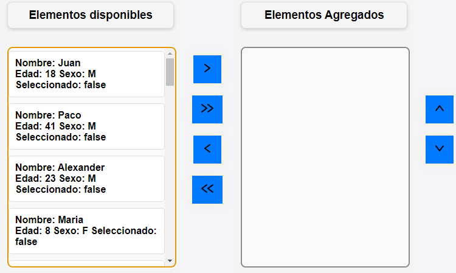
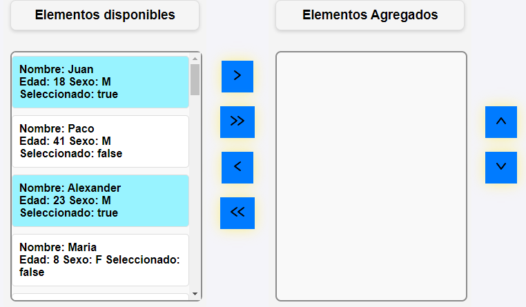
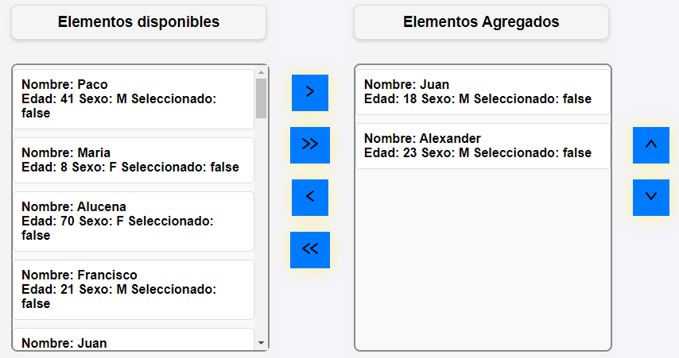
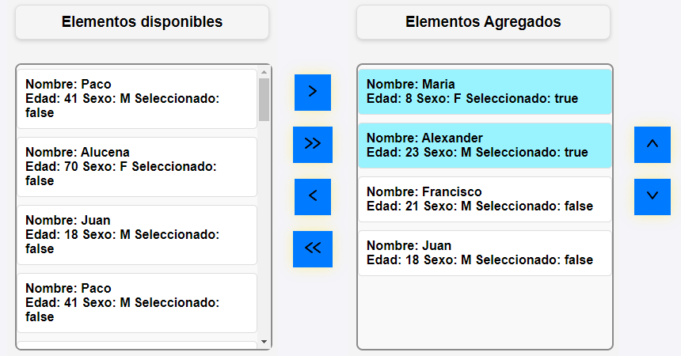

# Dual List Component

Este repositorio contiene un componente de lista dual (dual-list) que permite seleccionar y mover elementos entre dos listas, con funcionalidad de ordenamiento y selección múltiple.

## Características

- Selección de elementos de una lista y movimiento hacia otra.
- Ordenamiento de los elementos seleccionados.
- Diseño responsive compatible con dispositivos móviles.

## Instalación

1. Clona el repositorio.
2. Añade el componente vue a tu punto de montaje vue para integrar el elemento.


## Configuración

1. Para usar el componente dual-list debes pasar en las props un array de JSON el cual debe contener mínimo el atributo 'id'
2. En este caso el componente se ha renombrado como dual-list, el componente permite personalizar la visualización del contenido
   si no se personaliza el contenido se verá la información del JSON.
3. Los datos basicos para que el componente funcione seria el siguiente:

```
<dual-list :elements="elementsAvalibles"></dual-list>
```

4. Es posible personalizar los textos de los titulos de cada lista de la siguiente manera

```
<dual-list :elements="elementsAvalibles" :tituloDisponibes="'Elementos disponibles'" :tituloSeleccionados="'Elementos Agregados'"></dual-list>
```

5. En estos ejemplos se ha usado un template basico para mostar datos este quedaría:
```
<template v-slot="{ element }">
    <div>
        Nombre: {{ element.nombre }}
    </div>
    <div>
        Edad: {{ element.edad }}
        Sexo: {{ element.sexo }}
        Seleccionado: {{ element.selected }}
    </div>
</template>
```

6. Es necesario que el template integre **v-slot"{ element }"** para usar los datos de los JSON

## Cómo funciona

---

## **Vista de la interfaz principal**
  
Esta es la interfaz principal del componente. Está diseñada para ser clara y funcional, mostrando dos listas (disponibles y agregados) y botones para interactuar con ellas.

---

## **Selección de elementos**
  
Los usuarios pueden seleccionar uno o varios elementos tanto de la lista A como de la lista B. Esta funcionalidad permite elegir con precisión los elementos que se desean mover.

---

## **Añadir elementos a la lista B**
  
Los elementos seleccionados en la lista A pueden ser añadidos a la lista B con los botones de acción y viceversa pudiendo añadir elementos seleccionados o todos los elementos de una de las listas. Esto permite gestionar los elementos de manera organizada.

---

## **Selección en la lista B**
  
En la lista B, también se pueden seleccionar uno o varios elementos, lo que permite realizar acciones adicionales como moverlos o reorganizarlos.

---

## **Ordenar elementos en la lista B**
  
Los elementos seleccionados en la lista B se pueden ordenar fácilmente utilizando los botones de movimiento derechos. Esto asegura un control completo sobre el orden de los elementos.

---